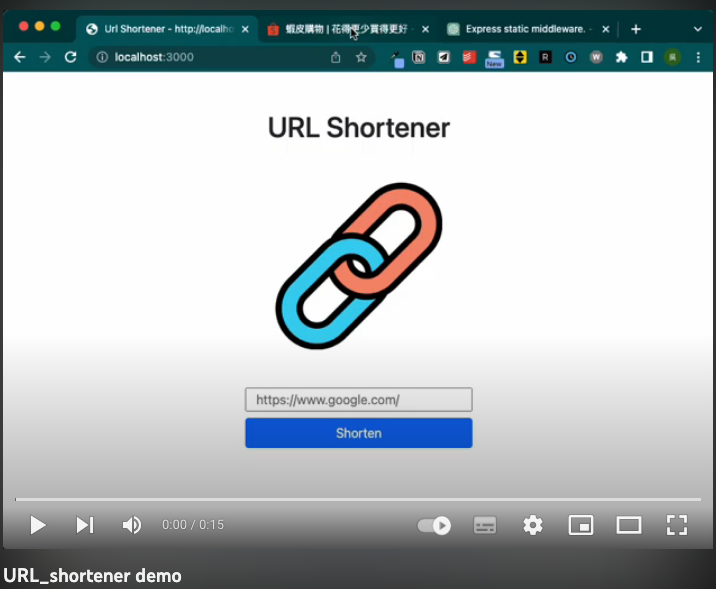
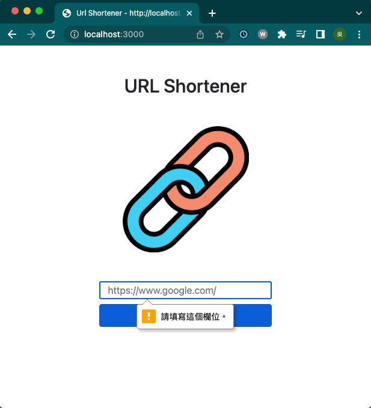

# URL_shortener

[](https://www.youtube.com/watch?v=COVLiuW_c1o)



## 簡介

一個縮網址小專案，可以將長長的網址轉換成短短的網址。

## 功能

- 可以將原始網址縮成較短的網址
- 可以使用短網址連向原始網站
- 不會產生重複的短網址
- 若沒輸入原始網址，無法產生短網址

## 開發環境與套件

* VS Code - 編程環境
* node.js / express.js@4.16.4- 後端框架
* express-handlebars@3.0.3 - 樣板引擎
* bootstrap@5.2.3 - 樣式
* fontawesome@5.8.1 (CDN) - icon
* MongoDB - 資料庫
* mongoose@5.9.7 - MongoDB ODM

## 安裝與執行

1.確認已安裝 node.js 、 npm

  - node.js 可透過nvm進行安裝,而 npm 會在安裝 node.js 自動下載。
  - nvm 安裝方式[傳送門](https://github.com/creationix/nvm)
  - node.js 安裝方式:
  ```bash
  $ nvm install 14.16.0
  ```

2.開啟Terminal, 將此專案 Clone 到本地

  ```bash
  $ git clone https://github.com/rr37/URL_shortener.git
  ```

3.進入此專案資料夾

  ```bash
  $ cd URL_shortener
  ```

4.安裝 npm 套件

  ```bash
  $ npm install
  ```

5.安裝完畢接續輸入

  ```bash
  $ npm run start
  ```

6.當Terminal顯示以下訊息，代表伺服器已成功運行

  ```
  Express is listening on localhost: 3000
  ```

7.若欲暫停使用

  ```
  ctrl + c
  ```

8.打開瀏覽器至以下網址操作看看吧

  ```
  http://localhost:3000
  ```

## 作者

* **rr37** 